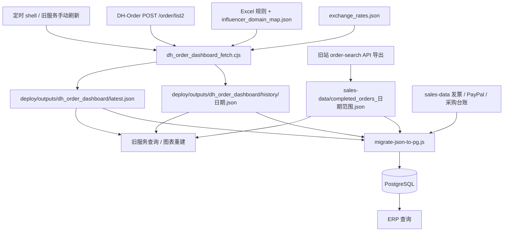
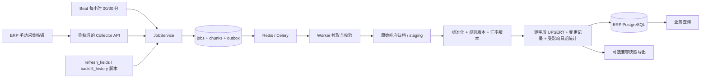

> 2026-09-07 接入修订：当前实现已改为 saveb-api 数据库 + saveb-admin 首页；以下 ERP 接入内容属于前一阶段记录。以 [最新接入说明](../saveb-api/COLLECTOR-INTEGRATION.md) 和 README 为准。

# SaveB 数据采集链路分析与重构方案

后续实现已落地，使用方法见 [README.md](README.md)，验证及部署边界见 [IMPLEMENTATION.md](IMPLEMENTATION.md)。本文保留为改造前的分析与设计基线。

分析日期：2026-09-07。范围：本地 `saveb-deploy`、`saveb-sales-data`、`saveb-erp`、`saveb-collector` 源码与文件清单。

本文是重构设计交付，不代表新脚本已经实现或上线。未连接生产服务器、未执行采集或数据库写入。线上 systemd、环境变量覆盖值、实际数据库结构和数据新鲜度需要部署前核验；旧文档的运行描述不能替代这些证据。

## 1. 结论与项目边界

| 项目 | 当前职责 | 重构后的职责 |
|---|---|---|
| saveb-deploy | 旧 Node 服务、DH-Order 采集、规则导出、JSON 台账、图表生成、运维脚本混在一起 | 提供迁移参考与对照样本，采集切换后退役对应任务 |
| saveb-sales-data | 数据目录，包含旧站导出的订单快照及发票、PayPal、采购等业务台账；不是采集服务 | 旧数据只读归档；如旧页面仍需 JSON，由新系统单向导出兼容文件 |
| saveb-erp | TypeScript API + PostgreSQL + Redis/BullMQ OCR Worker；包含 JSON 迁移、历史补库与兼容查询 | 负责业务权限、人工编辑、业务查询及按钮入口 |
| saveb-collector | Litestar + Celery + Redis + SQLAlchemy/asyncpg 骨架 | 统一负责上游采集、标准化、源字段入库、任务状态和历史更新 |

最重要的调整：将“采集 JSON → 另一定时器再导入数据库”改为“同一个采集任务校验后提交数据库”。JSON 只作为原始证据或兼容导出，不再作为定时同步的主通道。

## 2. 当前真实链路



图中没有“每次采集自动更新 completed_orders 文件”的箭头：在已检查的正式采集、图表重建和导入代码中，没有找到这个持续写入步骤。

### 2.1 定时入口到底做了什么

`saveb-deploy/scripts/saveb_sales_refresh_once.sh` 使用本机 `flock` 防止同一 shell 并发，顺序执行：

1. 导出站点规则 `export_dh_order_site_rules.py`。
2. 设置 `WRITE_HISTORY_RANGE=1`，调用 `dh_order_dashboard_fetch.cjs 今天 今天`。
3. 认证失败时，可调用配置的会话续签 helper 后重试一次。
4. `rebuild_chart_from_server.cjs` 重建图表。
5. 写 `refresh_status.json`，记录尝试、成功时间及错误。

这里的 30 分钟是外部调度周期，不是 shell 内部循环。脚本里的 `nextAttemptAt` 也只是状态信息，不会自行创建下一次执行。仓库旧文档提到 `saveb-sales-refresh.timer` 和 `saveb-erp-sync.timer`，本次未读取线上真实 unit，不能确认其当前开启状态与执行参数。

日期查询还会向前、向后扩一天，然后按业务时间筛选。另有历史 Pending 覆盖缓存和分片扫描；存在页数、时间和每轮分片预算，不等于每轮全历史均已刷新。

### 2.2 从哪里采，采哪些字段

订单主来源是 `https://www.dh-order.com/order/list2`，POST、Cookie 认证、每页 100 条，响应使用 `totalElement` 与 `data`。不是当前代码直接调用 Shopify 或 PayPal API。

| 信息 | 上游/处理来源 | 采集输出字段 |
|---|---|---|
| 订单身份 | order.orderId、clientOrderId | orderId、clientOrderId |
| 客户 | address 中姓名拼接 | customerFullName |
| 收款账户 | order.recipientAccount | recipientPaypal |
| 来源站点 | order.clientSite | clientSite |
| 支付 | amount、currency、paymentStatus | amount、currency、paymentStatus |
| 时间 | 创建、支付、完成、更新时间 | originalCreateTime、paymentTime、updateTime、timeColumnValues、accountingTime、createTime |
| 商品 | productList | products 中 name/url/image/productId，names，汇总 items |
| 渠道归属 | 域名规则与网红映射 | sourceCategory、category、topInfluencer |
| 客服归属 | 商品名称中的客服码、分摊规则 | staff、staffAllocations |
| 汇总 | 分类、件数及本地汇率 | totals、category、staff、paymentStatus 计数 |

额外注意：

- 商品图片字段通常是 URL，并非下载完整图片；部分线下订单会请求商品页，通过图片数辅助估算件数，耗时明显高于普通订单。
- `Completed` 进入销售订单列表；`Pending/Reversed/Refunded/Failed/Expired` 进入待处理集合；测试订单另行分组。
- 原始商品 `number` 用来算总件数，但当前 `products` 输出没有逐项保留它。重构要保留原始数量和完整原始响应。
- `latestOrderTime()` 从多个时间字段取最大值，甚至包含 `updateTime`，并把它作为 `accountingTime/createTime`。后续更新可能把订单移到另一个统计日。迁移不能悄悄改变此口径。
- 站点导出器读取固定 Windows 桌面的 Excel，再叠加映射；汇率是单独的 `fetch_dashboard_exchange_rates.py` 从 Frankfurter 获取。定时 shell 并没有调用汇率脚本。
- 汇率文件的含义是“1 USD 等于多少目标币”，所以美元金额 = 原币金额 / rate。缺失汇率在旧采集器中可能变成 0，重构必须阻止这种静默错误。

### 2.3 究竟写到哪个文件

| 文件（相对 E:/wwwroot） | 写入/用途 |
|---|---|
| saveb-deploy/outputs/dh_order_dashboard/latest.json | 采集器当前结果：orders、pendingOrders、testingOrders、统计；recent 只有前 30 条，不能用于全量入库 |
| saveb-deploy/outputs/dh_order_dashboard/history/YYYY-MM-DD.json | WRITE_HISTORY_RANGE=1 时按天写；旧手动单日刷新也会保存 |
| saveb-deploy/outputs/dh_order_dashboard/pending_coverage_cache.json | 历史待处理扫描缓存与分片续跑信息 |
| saveb-deploy/outputs/dh_order_dashboard/history_progress.json | 历史处理进度 |
| saveb-deploy/outputs/dh_order_dashboard/fetch_error.json | 采集错误 |
| saveb-deploy/outputs/dh_order_dashboard/refresh_status.json | 刷新状态 |
| saveb-deploy/outputs/dh_order_dashboard/site_rules.json | Excel/域名映射导出的分类规则 |
| saveb-deploy/outputs/dh_order_dashboard/exchange_rates.json | 独立汇率脚本写入 |
| saveb-deploy/outputs/dh_order_dashboard/chart_*.json | 图表重建结果 |
| saveb-sales-data/completed_orders_2021-08-10_to_2026-07-09.json | 旧站 `/api/order-search?...&orderStatus=Completed` 的导出快照，顶层 rows |
| saveb-sales-data/completed_orders_2021-08-10_to_2026-07-09.csv | 同查询的 CSV 导出，迁移主入口不读 CSV |
| saveb-sales-data/invoice_orders.json | 旧服务人工/OCR 发票业务台账，不是 DH-Order 定时采集输出 |
| saveb-sales-data/paypal_shared_state.json | 旧服务 PayPal 业务状态及导入脚本维护；不能等同于每轮实时抓 PayPal 余额 |
| saveb-sales-data/procurement_orders.json | 旧服务采购业务台账 |
| saveb-sales-data/influencer_domain_map.json | 人工确认域名归属，供采集/业务分类读取 |

`saveb-sales-data/manifest.json` 记录导出时间为 2026-07-09、源站为旧 Sales 网站及各 API endpoint。这证明该快照的来源，不能据此推断当前文件从未被后续人工修改。目录中的 `latest_good.json` 在本次检查的核心链路里没有找到读写依赖，不能把它当成自动入库入口。

`rebuild_chart_from_server.cjs` 通过正则改写并动态执行 `server.js` 中的图表代码；`rebuildChartData()` 读取 completed 快照与 history，再写图表，**不会把 history 合并回 completed 文件**。

### 2.4 怎样入 PostgreSQL

`saveb-erp/scripts/migrate-json-to-pg.js`：

1. 在 `--data-dir` 中按文件名字典序选最后一个 `completed_orders_*.json`，读取 `rows`。不是按 mtime，也不是读 latest.orders。
2. 同时读取发票、PayPal、采购、网红映射，以及 `--dashboard-dir` 中汇率、最新快照和历史快照。
3. 做哈希、身份歧义与数据校验；非 dry-run 模式开启数据库事务。
4. `importOrders()` 每批 500 条，以 `order_id` 冲突更新源字段。
5. 导入其余实体和兼容快照，重建 daily_stats，做入库对账；异常回滚数据库事务。

| 输入 | 数据库落点 |
|---|---|
| completed.rows | orders |
| invoice_orders | invoice_orders、invoice_items、invoice_staff_allocations、attachments |
| invoice_operation_logs | audit_logs |
| paypal_shared_state | paypal_accounts 及相关流水表、system_state 的兼容状态 |
| procurement_orders | procurement_tasks |
| influencer_domain_map | influencer_domains |
| exchange_rates | exchange_rates |
| history/*.json | legacy_dashboard_days |
| latest.json | system_state，key=legacy_dashboard_latest |
| 规则/汇率上下文、缺失日期 | system_state 中相关 legacy key |
| 订单、发票 | daily_stats 重建 |

关键订单字段映射：`orderId → order_id`，`clientOrderId → client_order_id`，`customerFullName → customer_name`，`clientSite → source_site`，`category/sourceCategory → classification`，`recipientPaypal → receiving_paypal`，`amount → amount_original`，`paymentStatus → order_status`，`items → items_count`，`names → product_name`；原行保存到 `raw`。旧实现还把 DH orderId 填入 `paypal_order_id`，名称与来源不一致，重构须核验 transactionId，不能沿字段名猜含义。

另一条 `backfill-canonical-orders-from-legacy.js` 从数据库兼容历史快照整理订单，可先导入指定快照。它补缺失订单，并更新已有订单的 `items_count`；并不是金额、状态、客户等全字段刷新工具。

ERP 查询目前同时有 canonical orders/invoice 查询及 legacy 快照兼容路径。因此可能出现“历史页面有新数据，但 orders 查询还是旧数据”。仅更新快照不能保证所有页面同步。

ERP `api/src-ts/routes/extensions.ts` 中 GET `/api/refresh` 明确返回 `_refreshQueued:false` 和 worker 未启用提示，实际只查数据库缓存。旧 deploy 的同名接口才会调 Node 采集器，而且它的进程内队列与 shell 的 flock 不是同一个锁。

## 3. saveb-collector 现状与必须先修的问题

| 现状证据 | 影响 / 改造 |
|---|---|
| settings 默认 dhgate.com；客户端 GET /dhsr/monitor/order/queryMonitorOrderList.do | 与旧系统 dh-order.com 的 POST /order/list2 不一致，先重做真实协议适配 |
| get_orders 仅取 data，无分页/totalElement 完整性校验 | 不能保证采集完整 |
| Cookie 只按 session 写入；续签 username 使用 dh_base_url 占位 | 不能视为可用认证方案；沿用受控完整 Cookie 与经验证续签流程 |
| classify 只加 _source/_classified_at；site_rules 返回 stub | 业务分类尚未迁移 |
| 输出 generated_at/count，与旧 ok/generatedAt/totals 等不同 | 当前 latest.json 并不真正兼容旧页面 |
| repositories 只实现 saveb_exchange_rates | 没有订单仓储；表名也与 ERP exchange_rates 不一致 |
| invoice/procurement API 是占位接受 | 应移除或明确返回未实现；发票/采购继续归 ERP，避免假成功 |
| Beat 已有 30 分钟任务，但无统一持久任务、互斥和补历史入口 | 现有调度骨架可复用，业务闭环不能直接上线 |
| Cookie crontab minute=*/50 | 是每小时 00/50 分，间隔交替 50/10 分钟，不是恒定 50 分钟 |
| Docker 本地启动独立 PostgreSQL | 生产应显式连 ERP 数据库；不能误连开发空库 |

## 4. 目标设计：三种入口，同一条处理链



继续采用仓库现有 Litestar、Celery、Redis、SQLAlchemy/asyncpg 技术栈。Celery 使用自己的消息协议，不复用 ERP BullMQ 队列键；OCR 继续由 ERP Worker 负责。公共业务表迁移统一由 ERP 的 Knex 管理；Collector 自有表放 collector schema，可由 Alembic 管理，避免两个工具改同一张表。

### 4.1 每 30 分钟字段刷新脚本

拟新增 `scripts/refresh_fields.py`，Beat 与 CLI 均调用 `JobService.submit(mode="refresh")`。Beat 配置 `crontab(minute="0,30")`，业务时区 Asia/Shanghai。脚本提交任务并返回 job_id，`--wait` 等待数据库提交结果并以退出码表达成功/失败。

拟定命令（接口契约，尚未实现）：

```bash
python scripts/refresh_fields.py --lookback-days 3 --include-open-orders --wait
```

默认策略：

1. 采集最近 3 个业务日的全部支付状态，分页拉全；该回看窗口是初始建议，可配置。
2. 对本地跟踪的历史未完成订单，优先按订单 ID 复查全部状态，捕获 Pending→Completed 等变化；不能只查上游 Pending 列表，否则完成后消失的订单无法更新。
3. 额外按历史游标轮询已完成旧订单的日期区间，发现退款、金额或状态追溯修改。
4. 如果协议验证证明支持“更新时间范围”，改用成功水位减重叠窗口进行增量；在验证前不能把 startDate 当更新时间过滤参数。
5. 同时更新本轮订单源字段：支付状态、金额/币种、收款账户、客户姓名、站点、商品/数量、原始时间。分类、美元金额、分摊由绑定版本的规则计算。
6. 仅提交成功后推进水位与 last_success_at。队列积压或历史待处理覆盖未完成时，状态必须显示延迟与未覆盖范围。

这里“每 30 分钟刷新”解释为每 30 分钟执行一轮增量和活跃订单字段更新，不代表所有历史订单每 30 分钟全部重抓。若要求全历史每半小时可见所有变更，必须先确认上游更新时间过滤能力、限流及总量；否则不能承诺该时效。

### 4.2 手动点击触发

ERP 增加“立即采集”，由 ERP 完成用户鉴权后调用 Collector；用户不直接接触 Cookie、数据库或 Redis。

拟定接口：

```http
POST /api/collect/jobs
Idempotency-Key: <本次点击唯一标识>
Content-Type: application/json

{"mode":"refresh","source":"dh-order","lookbackDays":3,"includeOpenOrders":true}
```

返回 202、jobId、状态查询地址。重复提交同一个幂等键返回同一任务；同源同范围已有活跃任务时合并/关联，不创建并行抓取。定时触发按“来源+调度时间槽”去重，不能用永久固定幂等键阻止未来轮次。

`GET /api/collect/jobs/{jobId}` 返回 queued/running/retrying/succeeded/partial_failed/failed/cancelled、页数、处理订单数、新增/更新/未变/隔离数、入库时间、覆盖区间及错误摘要。未知 ID 返回 404，不能把 Celery PENDING 当成已排队的证据。

按钮展示“排队 → 采集中 → 入库中 → 完成”，完成后刷新业务查询；权限至少拆分 collect.trigger、collect.backfill、collect.read。基于 Cookie 的 ERP 入口校验 CSRF，服务间请求认证，任务归属与审计保存操作者。

旧 GET `/api/refresh` 保留只读兼容语义，前端按钮改调 POST。历史补采可额外提供日期范围入口，使用同一个任务体系。

### 4.3 更新历史数据脚本

拟新增 `scripts/backfill_history.py`，支持三种显式模式：

| 模式 | 行为 |
|---|---|
| missing | 补没有成功覆盖记录的日期 |
| refresh | 重新从上游采集指定范围，更新已存在订单的源字段，补新增订单 |
| reprocess | 使用归档原始响应和指定规则/汇率版本重新计算，无须重抓 |

```bash
python scripts/backfill_history.py --start 2021-08-10 --end 2026-09-06 --mode refresh --chunk-days 1 --dry-run
python scripts/backfill_history.py --start 2021-08-10 --end 2026-09-06 --mode refresh --chunk-days 1 --wait
python scripts/backfill_history.py --resume <job-id> --failed-only --wait
```

dry-run 可读取上游并写隔离的任务/预览证据，但不更新正式订单、统计或正式水位。恢复参数与原任务配置绑定；更换模式/规则版本应创建新任务。

按日分片，页数过大再细分（是否可细分到小时须先验证上游参数）。分片持久化状态与页校验和，失败仅重试失败分片；分页顺序不稳定时从分片第一页重跑，不能盲目续用失效页码。全量任务不使用一个数小时数据库事务。

历史任务独立低并发队列，实时任务独立 worker；同一个来源账户使用共享限流与分片租约，实时优先，历史任务在页/分片边界让出资源。历史任务不得覆盖实时 latest 指针。

## 5. 数据表、更新原则与一致性

建议新增以下 Collector 表，而非复制整套 ERP 业务表：

| 表 | 关键字段与用途 |
|---|---|
| collector.jobs | id、mode、source、requested_by、idempotency_key、parameters、status、计数、错误、开始/提交时间 |
| collector.job_chunks | job_id、区间、状态、页进度、attempt、lease_owner、lease_until、fencing_token；分片唯一键 |
| collector.outbox | 已受理但待投递任务/提交后投影事件；与 jobs 或业务更新同事务，投递可重试 |
| collector.raw_batches | job/chunk、request scope、page、响应路径/JSONB、hash、fetched_at、schema_version；不存认证头 |
| collector.source_orders | source/account/order_id 唯一、上游原始字段、source_updated_at、payload_hash、规则/汇率版本、last_seen_at |
| collector.checkpoints | 来源/范围/模式水位、完成覆盖区间；不以单一 max(date) 冒充完整覆盖 |
| collector.order_changes | order_id、字段差异、原值/新值、任务、来源版本、修改原因 |

source_orders 关联现有 orders，避免立即修改 ERP 的全局 order_id 唯一键。若存在多来源订单号冲突，先建立外部身份映射并迁移，不能直接拼接新 ID 破坏采购关联。

事务流程：完整分片拉取 → 原始证据/staging → 完整性与唯一键校验 → 锁定目标行 → 更新源字段及 ERP 投影 → 重算受影响业务日 → 保存变更/完成分片/水位/outbox → commit。

关键约束：

- 幂等 UPSERT，并比较可信 source_updated_at 和内容 hash；同版本不同内容进入冲突处理。没有可信更新时间时用同源串行抓取、服务端租约 fencing 防止过期任务提交；不能拿本地 fetched_at 证明内容更“新”。离线旧原始包重放默认写影子结果，不能覆盖较新源事实。
- 只有验证过身份的 order_id 才能入正式表；缺少 ID 的记录隔离，不使用 legacy-row-序号。
- 字段缺席与显式置空分开处理；保留人工修正层（现有业务 override + 必要新增覆盖字段），不能把上游整行覆盖人工客服/渠道确认、采购、发票或财务台账。
- 金额用 Decimal/NUMERIC，保存原币、汇率方向、有效日期和版本；未知币种或缺失汇率隔离，不以 0 伪装正常。实时行情更新不能默认重估全部历史收入。
- 原始创建、支付、完成、修改时间独立保存，统计 business_date 单独派生；初次迁移保留兼容日期投影，另输出按新口径的差异。新的入账口径必须在切换前明确。
- 订单日期/渠道改变时，同时重算旧日旧渠道和新日新渠道，移除已变成零的旧统计桶。统计重算以一致事务快照和按日锁保证并发安全，不再全表删除 daily_stats。
- 接入全部支付状态之前，先修复旧统计函数对 orders 未过滤 Completed 的假设，审计 ERP 每个查询/导出；Pending/退款不能被误加进已完成销售额。
- 全页成功且数量、重复键检查通过才发布分片；认证失败、HTML 登录页、异常空响应、部分分页失败均不能发布为成功。合法空日需要明确成功覆盖标记，不能和采集失败混用。
- 没抓到某订单不等于删除。只有明确的上游撤销/退款/删除证据才按业务规则改变状态。
- 同账户、重叠分片用带续租的互斥，并在提交时校验 fencing token。三个触发入口共享此机制，不依赖 worker 单进程队列。
- 业务提交后再导出兼容 JSON；导出失败单独重试，不撤销已提交事实，也不能声称“所有兼容页面已刷新”。兼容文件按 job/version 分目录原子发布 manifest，不裸覆盖共享 latest。

Celery 周期任务可能重叠且同一计划应由单一调度器负责，因此必须有上述任务去重和执行锁：[官方周期任务说明](https://docs.celeryq.dev/en/latest/userguide/periodic-tasks.html)。数据库条件 UPSERT 可使用 ON CONFLICT DO UPDATE 的 WHERE 条件：[PostgreSQL INSERT 文档](https://www.postgresql.org/docs/current/sql-insert.html)。队列层不承诺只执行一次，重复投递由数据库幂等收敛。

## 6. 目录与分阶段实施

拟定增改文件：

```text
saveb-collector/
  app/api/jobs.py                  # 提交/查询/取消/重试，权限与参数校验
  app/services/job_service.py      # 三种入口共用的任务受理
  app/services/collection.py       # 分片流程、校验、状态机
  app/collectors/dh_order.py       # 替换占位接口、分页、认证
  app/domain/orders.py            # 标准订单与字段存在性
  app/domain/classification.py    # 版本化规则
  app/persistence/orders.py       # 源字段 UPSERT、人工覆盖保护
  app/persistence/jobs.py         # 状态、水位、租约
  app/queue/tasks.py              # refresh/backfill/reprocess
  app/queue/outbox_dispatcher.py  # 可靠投递
  scripts/refresh_fields.py       # 30 分钟任务同源入口
  scripts/backfill_history.py     # 历史补缺/刷新/重算/恢复
  migrations/                    # 仅 collector schema
  tests/                         # 协议、业务、并发与故障用例
```

阶段 A：核实生产 timer/服务参数、实际数据库和当前覆盖区间；用脱敏真实响应固定接口契约，确认分页、日期过滤、订单身份、Cookie 续签。锁定依赖，移除未使用 django-celery-beat 及重复依赖配置，生产运行在 Linux worker。

阶段 B：完成 DH-Order 客户端、原始归档、标准化、仓储、任务/outbox/锁；实现 refresh_fields.py、backfill_history.py。先接影子 schema，禁止旧新采集器同时写同一业务表。

阶段 C：迁移分类规则与日期/汇率口径；对相同原始数据做旧新差异对照。补齐状态过滤与人工覆盖保护，完成 ERP POST 按钮和持久任务进度。

阶段 D：最近 7 天及历史边界月份影子对账，随后整段历史 dry-run。按天/状态/渠道/客服/币种比订单 ID 集合、件数、原币金额、美元金额；同口径美元结果到分一致，有意口径差异单独报告。

阶段 E：确定切换水位，停旧采集与自动 JSON 导入写入，启动新 Beat/worker，补齐交接期间窗口。ERP 原有 API 不需整体切 nginx 到 Collector；只增加采集 API 内网连接。旧文件归档，逐步清理兼容读取。

回退：先停止 Collector 正式发布，保留原始数据、作业与变更记录；恢复原查询/调度前确认写入水位和字段归属。已产生的新业务数据不能被旧 JSON 全量重导覆盖；需要按任务变更记录处理回退，不能直接还原整库丢弃期间人工编辑。

## 7. 验收清单

| 场景 | 必须得到的结果 |
|---|---|
| 超过 100 条订单 | 分页全量、重复键可追踪、源数量核对 |
| 定时与按钮同时触发 | 单次有效发布，重复请求可关联同任务 |
| Worker 抓完崩溃/提交后未 ACK | 可恢复，无重复订单/重复统计 |
| 数据库受理后 Redis 不可用 | outbox 保留并补投，页面显示待派发 |
| Cookie 失效或返回登录页 | 明确认证失败，保留最后成功数据 |
| 旧 Pending 今天 Completed | 原行更新，正确进入销售统计 |
| 已完成订单后续退款或金额修正 | 历史扫描能发现，原统计同步修正 |
| 历史任务落后于实时任务 | 旧结果不能覆盖新结果 |
| 金额、日期、渠道变化 | 原统计桶和新桶同时正确，人工覆盖保留 |
| 合法空日/缺页 | 分别标记完整覆盖/失败，不发布残缺数据 |
| 更新汇率或分类规则 | 可按版本重放，历史重估为显式动作 |
| 前端点击采集 | 真任务 ID；数据库提交后显示成功，不是缓存假刷新 |
| 运行时效 | 无积压时单轮目标小于 10 分钟；展示队列延迟与历史覆盖滞后，超时告警 |

## 8. 核心源码证据索引

- [定时刷新 shell](E:/wwwroot/saveb-deploy/scripts/saveb_sales_refresh_once.sh)
- [上游请求与分页](E:/wwwroot/saveb-deploy/scripts/dh_order_dashboard_fetch.cjs:583)
- [采集字段构造](E:/wwwroot/saveb-deploy/scripts/dh_order_dashboard_fetch.cjs:860)
- [采集落盘位置](E:/wwwroot/saveb-deploy/scripts/dh_order_dashboard_fetch.cjs:1020)
- [图表重建读取快照](E:/wwwroot/saveb-deploy/server.js:3113)
- [旧手动采集](E:/wwwroot/saveb-deploy/server.js:6554)
- [旧站导出清单](E:/wwwroot/saveb-sales-data/manifest.json)
- [JSON 迁移订单 UPSERT](E:/wwwroot/saveb-erp/scripts/migrate-json-to-pg.js:448)
- [JSON 迁移事务与对账](E:/wwwroot/saveb-erp/scripts/migrate-json-to-pg.js:902)
- [历史补库仅修件数](E:/wwwroot/saveb-erp/scripts/backfill-canonical-orders-from-legacy.js:329)
- [ERP 刷新占位实现](E:/wwwroot/saveb-erp/api/src-ts/routes/extensions.ts:179)
- [Collector 当前采集器](E:/wwwroot/saveb-collector/app/collectors/dh_order.py)
- [Collector 当前调度](E:/wwwroot/saveb-collector/app/queue/celery_app.py)
- [Collector 当前仓储](E:/wwwroot/saveb-collector/app/persistence/repositories.py)
