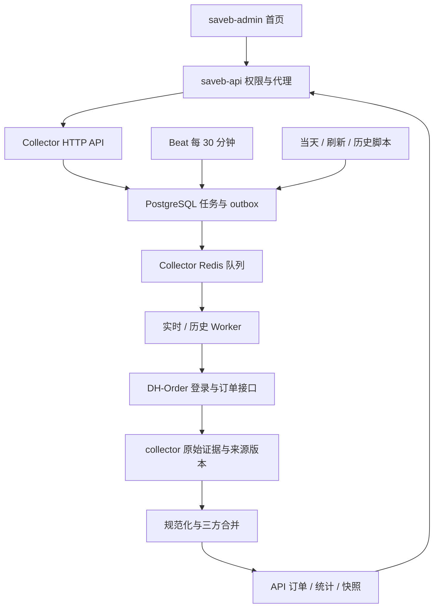

# saveb-collector 项目说明文档

## 订单日期口径升级

2026-09-08 起，订单日期使用来源 `createTime`，不再取创建/付款/完成/更新时间的最大值。付款、完成、来源更新时间均有独立可空字段；订单及现有按订单日期的统计归到创建日。旧服务器数据缺少这些字段仍可导入；证据不足时保留旧日期。升级、修正及迁移兼容流程见 [订单日期与旧数据迁移说明](订单日期与旧数据迁移说明.md)。

## 2026-09-08 新增：Pending 专用发现、采集对账、备份恢复验证

已实现三项运维补强，完整命令、写表清单、失败处理见 [采集巡检与备份说明](采集巡检与备份说明.md)。

| 功能 | 调用位置与默认时间 | 数据写入 |
| --- | --- | --- |
| 历史 Pending 专用发现 | `app/queue/celery_app.py` 每 60 秒检查；`app/services/pending.py` 默认每 30 分钟规划 7 天历史区间，由 history worker 执行；支持 `scripts/discover_pending.py` 手动范围和续跑 | 原有来源/订单发布表，新增 `collector.pending_state`、`collector.pending_coverage`；不写全量日期覆盖表 |
| 采集对账 | `app/services/collection.py` 发布分片时执行；Beat 每天北京时间 03:10 执行全范围对账；`scripts/reconcile.py` 手动指定日期 | 只新增 `collector.reconciliation_reports` 报告，不修复业务数据 |
| 备份恢复验证 | `scripts/backup_restore.py`；Windows 安装 `scripts/install_backup_task.ps1` 后默认每天本机 02:15 运行 `scripts/backup_daily.ps1` | 全库 dump、附件归档、行数/哈希清单；恢复到随机临时库核对后删除，不覆盖业务库 |

升级先执行 `migrations/003_operations.sql`（`docker compose run --rm migrate`），再启动新版 API/worker/history/maintenance/Beat。备份任务独立于 Beat，需要安装操作系统计划任务。Pending 间隔独立于管理页的字段刷新间隔。

对账有差异时记录 warning，但采集成功仍显示成功；无新订单不会判失败。Pending 继续保留人工修改和软删除，超预算区间自动拆分，整个自动区间成功后才推进游标。

本文对应 2026-09-07 的实现，面向开发、部署和日常运维。命令默认在 `saveb-collector` 根目录的 PowerShell 执行；日期和任务 ID 示例请替换为实际值。

## 1. 项目定位与关系

采集器从 DH-Order 读取收单订单，验证、规范化并直接更新 saveb-api 的 PostgreSQL。saveb-admin 提供首页状态和手动采集入口。

| 项目 | 当前关系 |
| --- | --- |
| saveb-collector | 登录、采集、调度、原始归档、订单合并、统计更新 |
| saveb-api | 业务数据库归属方；提供受权限保护的采集状态与触发接口 |
| saveb-admin | 首页 `#refreshText` 和“采集当天数据”按钮 |
| saveb-source | 首页状态展示的参考，不承担当前采集调度 |
| saveb-deploy、saveb-erp | 旧实现参考，当前采集不依赖其运行 |
| saveb-sales-data | 当前链路不向其中某个文件写入后再入库 |



技术栈为 Litestar、Celery、Redis 和 asyncpg，推荐部署环境是 Docker 中的 Python 3.12。

## 2. 采集信息与存储位置

### 来源字段

通过受保护的 `/order/list2` 发起 JSON POST，每页 100 条。校验成功码、响应结构、分页总数稳定性、订单 ID 唯一性和指定订单查询结果，异常响应不会默认为正常空数据。

| 来源信息 | 用途 |
| --- | --- |
| `order.orderId`、`clientOrderId` | 来源标识、客户订单号，以订单号关联 API 订单 |
| `amount`、`currency`、`paymentStatus` | 原币金额、币种、付款状态及美元折算 |
| 创建、支付、完成时间和 `updateTime` | 来源版本和统计归属日期 |
| `clientSite`、`recipientAccount` | 站点分类和收款账户信息 |
| `address` 中的客户姓名 | 客户展示、测试订单识别 |
| `productList` 中商品名、数量、链接、图片和 ID | 商品摘要、件数、员工归属识别 |
| `order.remark` 等其他返回字段 | 原始归档；备注不参与核心字段规范化 |
| 分类规则、确认的网红域名、汇率 | 主站/网红/线下归类、人员分配、币种折算 |

原始响应可能包含表中摘要以外的来源字段，归档与订单数据应采用相同的数据库访问和备份权限。

### 写入位置

以下表均位于 `SAVEB_DATABASE_URL` 指定的同一数据库：

| 表或字段 | 作用 |
| --- | --- |
| `collector.jobs` | 模式、操作者、冻结参数/规则、总体状态 |
| `collector.chunks.raw` | 分片原始响应证据，不需要 sales-data 文件中转 |
| `collector.chunks` | 范围、尝试次数、计数、错误和执行状态 |
| `collector.outbox` | 可靠派发与重投 |
| `collector.source_orders` | 最新来源版本、规范化结果和指纹 |
| `collector.changes` | 来源规范化结果的变更记录 |
| `collector.coverage`、`collector.checkpoints` | 日期覆盖与历史滚动游标 |
| `collector.scheduler_state` | 定时提交的尝试、成功心跳及错误 |
| `collector.exchange_rates` | 采集器汇率快照 |
| `public.orders` | API 业务订单 |
| `public.daily_stats` | 受影响日期的非 Invoice 统计 |
| `public.legacy_dashboard_days` | 兼容首页的日期快照 |
| `public.system_state` | 最新快照及刷新状态；同时读取既有规则上下文 |
| `public.exchange_rates` | API 使用的汇率 |

`SAVEB_PUBLISH_API=false` 不发布 API 业务表。`dryRun=true` 保存任务、归档与差异预览，不推进来源订单、业务订单和覆盖进度。

可选 `scripts/export_legacy.py --output <目录>` 从数据库导出版本目录、`history/YYYY-MM-DD.json`、可用时的 `latest.json`、校验清单及原子切换的 `current.json`。这是导出功能，文件不是入库来源；容器输出目录需挂载到宿主机才能持久保留。

## 3. 入库机制与业务约束

1. 提交任务时冻结来源账户、日期、发布模式、分类规则和汇率上下文。
2. 同账户用 PostgreSQL 会话锁覆盖抓取和提交，避免实时与历史任务相互覆盖。
3. 保存原始响应，验证并规范化整个分片；不合法订单会使分片失败。
4. 校验来源版本并合并订单；业务更新、日期统计、覆盖记录和分片成功状态原子提交。
5. 汇总任务结果；恢复失败任务时保留已完成分片，仅续跑失败部分。

三方合并比较“上次来源值、本次来源值、当前业务值”，保留 API 人工调整；独立人工覆盖表不受影响。保留 `entity_uuid`、`visible_order_id`，正常更新递增 `version`，不复活软删除订单。较旧来源不能覆盖新版本，相同 `updateTime` 的关键字段变化仍触发冲突。

来源只改 `order.remark` 或 `productList[].productImg` 而不改 `updateTime` 时允许同步，完整备注和图片地址仍保留。原币金额和币种不变时保留既有美元金额，不因汇率刷新自动重估历史销售。跨日期更新同时重建前后日期统计；发票、采购和独立财务台账仍由 API 自身维护。

当前沿用 `legacy-latest-time-v1`：取创建、支付、完成、更新时间中的最新时间作为统计日期。“当天数据”不等于单纯按创建日筛选。若要改变日期口径，需要另行设计迁移与重算。

采集结果中的 inserted/updated 按来源记录分类，不能直接当成 API 新增业务行数。

## 4. 采集模式与登录机制

### 模式与调度

| 模式 | 入口 | 范围 |
| --- | --- | --- |
| `refresh` | Beat / `refresh_fields.py` | 默认当天＋前一天，先采当天；另建独立 history 任务复查历史未完成订单及一个历史滚动日 |
| `today` | 首页 / `collect_today.py` | 提交时固定北京时间当天，仅发布规范化日期属于当天的订单 |
| `history` | `backfill_history.py --mode refresh` | 指定范围重新抓取，已覆盖日期也更新 |
| `missing` | 历史脚本 `--mode missing` | 补未成功覆盖的日期；发布模式检查发布覆盖 |
| `reprocess` | 历史脚本加 `--source-job-id` | 基于原始归档重新计算，强制预览，不直接发布 |

时区为 `Asia/Shanghai`。刷新间隔默认 30 分钟，现由采集管理页配置；具体调度代码和生效方式见第 11 节。outbox 每 15 秒派发，汇率每小时 05 分更新。历史复查使用独立 history 任务（params.task_kind=open_recheck），同账户和发布模式已有任务时复用，不在每次自动刷新重复堆积。历史滚动默认从 `2021-08-10` 开始，每轮历史复查推进一个日分片；历史单号较多时复查可持续数小时，但不再阻止近期自动任务。

来源查询带前后日期补边。today 按规范化日期再次筛选；刷新和历史保留补边结果，用于纠正跨日变化。因此 fetched 可以大于当天 selected，历史采集也可能更新范围边缘之外的关联订单。

任务状态包括 queued、running、retrying、succeeded、failed、partial_failed、cancelled。提交成功不是完成；取消不撤销已提交分片。

### 账号密码与会话

配置完整账号密码后，访问正常登录页面、获取四位图片验证码、本地 ddddocr CPU 识别、提交登录表单。校验同站点跳转和受保护订单响应后缓存会话，不依赖旧 systemd 续期脚本或固定服务器路径。

- 每轮默认最多 3 次，明确凭据错误提前停止。
- 会话在 Collector Redis 共享，默认有效期 28,800 秒（8 小时）。
- 登录锁避免并发重复登录，失败有 300 秒冷却期。
- 来源会话失效时，有账号密码则重新获取会话并重试一次。
- 未配置完整账号密码时可使用手工 Cookie，过期需要人工更新。
- 验证码识别可能失败，失败会返回安全错误码。

密码保留实际字符，全角 `！` 与半角 `!` 不同。真实凭据只放在被忽略的 `.env`，不要在命令行传入或提交到 Git。

```powershell
docker compose run --rm api python scripts/login.py
```

登录脚本准备或复用缓存会话，不打印 Cookie。缓存命中时不会强制重新登录；用于登录验证的零宽日期查询为空，也不代表当天没有订单。

## 5. 本地部署

### 首次配置

需要 Docker Desktop/Linux 容器、来源站点网络，以及已初始化的 API 数据库。默认外部网络为 `saveb-api_saveb-api-net`，数据库容器别名为 `saveb-api-postgres`。

```powershell
# 保留已有配置
if (!(Test-Path .env)) { Copy-Item .env.example .env }
# 仅首次安装且没有 Python 环境时创建；已有环境使用其 Python 即可
py -3.12 -m venv .venv
.\.venv\Scripts\python.exe -m pip install -r requirements.lock
.\.venv\Scripts\python.exe scripts/configure_api.py --api-dir ../saveb-api
```

配置脚本适用于上述本机 Docker 布局：读取 API 数据库凭据，设置 Collector 数据库与 Redis 地址，同步两边令牌和来源账户。它修改两边 `.env`，不采集订单；其他服务器需手工配置实际主机地址。

随后在本地编辑 `.env` 中的账号密码。配置脚本末尾可能仍提示需要 Cookie，这是旧提示；完整账号密码同样受支持，无需同时配置 Cookie。

确认 API 包含采集接口和权限迁移，并让 Laravel 加载新配置。普通角色分别授予状态查看和触发权限，见 [API 接入说明](../saveb-api/COLLECTOR-INTEGRATION.md)。

### 启动与检查

```powershell
powershell -ExecutionPolicy Bypass -File scripts/start_local.ps1
docker compose ps
Invoke-RestMethod http://127.0.0.1:8085/ready
docker compose exec api python scripts/collect_today.py --wait
```

脚本依次构建、迁移、preflight、准备会话、启动全部服务。检查失败会停止后续步骤，但不会自动停止此前已运行的容器。迁移只处理 collector schema，不初始化或清空 API 业务表。

当前数据库即使名为 `test` 也可能承载真实业务，不能在其上运行测试清库或 `migrate:fresh`。

| 服务 | 用途 |
| --- | --- |
| api | HTTP；宿主机仅绑定 `127.0.0.1:8085`，容器内 8080 |
| worker | collect 实时队列，并发 2 |
| history | 历史队列，并发 1，给实时任务让路 |
| maintenance | outbox、调度等维护任务，并发 1 |
| beat | 单实例定时器，状态保存在命名卷 |
| redis | 专属队列与会话，AOF 持久化，不暴露宿主机端口 |

API 容器通过 `http://saveb-collector-api:8080` 访问采集器，不能用容器内 localhost 代替。Redis 使用唯一别名 `saveb-collector-redis`，避免连接到 API 的 Redis。

### DNS、更新与原生 Windows

构建受代理或 DNS 影响时：

```powershell
powershell -ExecutionPolicy Bypass -File scripts/start_local.ps1 -OfflineBuild
```

该选项先下载 Linux wheels 到 `.wheels/` 再构建，首次仍需联网。运行容器 DNS 可用 `SAVEB_DNS_PRIMARY`、`SAVEB_DNS_SECONDARY` 调整，默认 `1.1.1.1`、`8.8.8.8`。

修改 `.env` 后重新创建容器，普通 restart 不会重新注入环境：

```powershell
docker compose up -d --force-recreate --no-build api worker history maintenance beat
```

源码更新先执行 `docker compose build api`，再 `docker compose up -d --no-build`，使所有服务使用同一新版镜像。切换发布目标后创建新任务，不恢复冻结旧 ERP 上下文的任务。

原生 Windows 使用 Python 3.12，需改为宿主机可达的 PostgreSQL/Redis 地址并独立启动 API、worker 和 Beat；worker 使用 `--pool=solo`。默认 `.env` 是容器网络配置，不可直接照搬到宿主机。日常运行优先 Docker。

## 6. 配置参考

| 配置项 | 说明 |
| --- | --- |
| `SAVEB_DATABASE_URL` | API 实际 PostgreSQL DSN，密码中特殊字符需 URL 编码 |
| `SAVEB_PUBLISH_API` | 模板为 true；代码未配置时默认为 false |
| `SAVEB_API_TOKEN` | 与 API `SAVEB_COLLECTOR_TOKEN` 一致，至少 32 字符 |
| `SAVEB_SOURCE_ACCOUNT` | 默认 default，与 API `SAVEB_COLLECTOR_ACCOUNT` 一致 |
| `SAVEB_CELERY_BROKER_URL` | Docker 示例 `redis://saveb-collector-redis:6379/1`，会话缓存也使用它 |
| `SAVEB_CELERY_RESULT_BACKEND` | Docker 示例 `redis://saveb-collector-redis:6379/2` |
| `SAVEB_DH_BASE_URL` | `https://www.dh-order.com`，来源地址受校验 |
| `SAVEB_DH_USERNAME` / `SAVEB_DH_PASSWORD` | 优先账号密码登录 |
| `SAVEB_DH_COOKIE` | 无完整账号密码时的手工会话 |
| `SAVEB_DH_LOGIN_ATTEMPTS` | 默认 3，范围 1–5 |
| `SAVEB_DH_SESSION_TTL` | 默认 28800 秒 |
| `SAVEB_FETCH_TIMEOUT_SECONDS` | 默认 60 秒，最大 240 |
| `SAVEB_REQUEST_INTERVAL_SECONDS` | 默认 0.5 秒 |
| `SAVEB_MAX_PAGES` | 默认 200，最大 1000，超限失败而非截断成功 |
| `SAVEB_MAX_ATTEMPTS` | 默认 3，任务重试上限；不可重试错误直接失败 |
| `SAVEB_HISTORY_START` | 默认 2021-08-10 |
| `SAVEB_RULES_FILE` / `SAVEB_RATES_FILE` | 可选覆盖配置，容器使用 `/app/config/...` 路径 |
| `SAVEB_API_NETWORK` | Compose 外部网络，默认 saveb-api_saveb-api-net |

规则默认读取 API `system_state.legacy_dashboard_context`，合并确认有效的网红域名，支持文件覆盖。汇率口径为“每 1 USD 对应多少目标币”，美元金额为原币金额除以该汇率；API `rate_to_usd` 取倒数。小时任务从 Frankfurter 取汇率，同日期已有记录不覆盖。

可选规则 `productImageHosts` 限制商品站点为白名单 HTTPS，限制重定向、响应大小和并发；失败回退商品数量并记录依据。

## 7. 脚本与接口

### 日常命令

```powershell
docker compose exec api python scripts/refresh_fields.py --wait
docker compose exec api python scripts/collect_today.py --wait
docker compose exec api python scripts/backfill_history.py --start 2026-08-01 --end 2026-08-31 --mode refresh --wait
docker compose exec api python scripts/backfill_history.py --start 2026-08-01 --end 2026-08-31 --mode missing --wait
docker compose exec api python scripts/backfill_history.py --start 2026-08-01 --end 2026-08-31 --dry-run --wait
docker compose exec api python scripts/backfill_history.py --resume JOB_ID --wait
```

归档重算预览：

```powershell
docker compose exec api python scripts/backfill_history.py --start 2026-08-01 --end 2026-08-31 --mode reprocess --source-job-id JOB_ID --wait
```

日期包含两端，分片固定一天。`--lookback-days` 调整回看天数；`--no-open-orders` 关闭未完成订单复查，不关闭历史滚动。resume 已经只重试失败分片，无需另加 `--failed-only`。

脚本直接提交持久任务，仍需要 outbox 和 worker。`--idempotency-key` 可指定重复提交标识，同操作者相同标识但参数不同会被拒绝。不带 wait 返回 0 仅表示提交成功；带 wait 成功为 0、终态失败为 1、等待超时为 2，超时后台任务继续。

### Collector 内部 HTTP

除健康接口外使用 `Authorization: Bearer <服务令牌>`，令牌仅在服务端持有。

| 方法与路径 | 用途 |
| --- | --- |
| `GET /health` | 进程健康，不验证采集 |
| `GET /ready` | 数据库/schema 就绪，不等于登录或调度正常 |
| `GET /metrics` | 需认证，任务状态与活跃任务时长 |
| `POST /api/collect/jobs` | 创建，需 Idempotency-Key，可带 X-Collector-Actor |
| `GET /api/collect/jobs/{id}` | 任务与分片结果 |
| `POST /api/collect/jobs/{id}/resume` | 恢复失败或部分失败任务 |
| `POST /api/collect/jobs/{id}/cancel` | 停止后续执行 |

当天请求为 `{"mode":"today"}`，不允许自选日期。历史 HTTP 使用 mode=history，与历史 CLI 的 `--mode refresh` 命名不同。返回 202 表示受理，不是完成。请求字段见 [JobRequest](app/domain/jobs.py)。

## 8. 首页监控与权限

浏览器调用 saveb-api，由 API 校验权限并代理内部请求，不向浏览器暴露采集器令牌。

| API | 权限 |
| --- | --- |
| `GET /api/collector/status` | `dashboard.overview.collector_status` |
| `POST /api/collector/today` | `dashboard.overview.collector_trigger` |

触发请求包含 UUID requestId，用作幂等键；操作者记录为 `saveb-api:{用户ID}`。API 验证返回任务处于当前业务库、实际发布、操作者正确且为 today，防止错误数据库或影子任务被当作成功。

[首页组件](../saveb-admin/src/views/dashboard/components/CollectorStatus.vue)正常每 10 秒轮询，连接错误每 30 秒重试；发现新的成功任务后刷新首页所选日期的数据，但按钮始终采集北京时间当天。

首页的“最近成功采集”是采集任务成功完成时间，不是订单更新时间。没有新增订单、订单时间不变或全部记录未变化，只要采集正常完成，也显示成功并更新该时间。该成功记录独立显示，其他任务正在运行时仍可查看。请求刚受理只表示排队，尚不能视为完成。

状态分两部分：采集结果只看同账户、实际发布、非预览的 refresh/today；历史任务不刷新半小时成功时间。动态调度心跳表示每分钟检查成功，不是业务入库成功；启用动态配置后超过 5 分钟或有错误判为异常。

最近成功超过配置的采集间隔提示陈旧，活跃任务连续 35 分钟没有成功分片提交才提示异常（尚未完成任何分片时从任务创建时间计算）。手动成功不能掩盖 Beat 停止。失败时保留最近成功时间，仅表示以前成功过。预计下次时间来自数据库动态计划，不保证该秒完成。

## 9. 故障排查

先检查服务和近期日志，再定位任务及失败分片：

```powershell
docker compose ps
docker compose logs --tail 100 api worker history maintenance beat
docker compose run --rm api python scripts/preflight.py
docker compose run --rm api python scripts/login.py
```

preflight 检查数据库、规则、令牌基本配置和 Redis，不采集订单；login 准备会话，不发布订单。不要将 `.env`、Cookie 和完整客户原始数据输出到共享日志。

| 现象 | 排查方向 |
| --- | --- |
| SOURCE_VERSION_CONFLICT | 相同 updateTime 的受保护来源字段变化；对比归档与上次来源版本，不关闭整体校验 |
| 登录或验证码失败 | 核对账号、密码字符、网络；等待 5 分钟冷却；环境变更后重新创建容器 |
| AUTH_SESSION_INVALID | 手工 Cookie 失效或自动登录未成功，检查登录脚本 |
| UPSTREAM_NOT_JSON | 可能返回登录页或异常页面；重新认证后仍失败需核对来源响应 |
| CURRENCY_RATE_MISSING | 币种缺少有效汇率；修复配置后新建任务加载新上下文 |
| 一直 queued | 检查 Beat、maintenance、Redis 和目标 worker，仅 API 无法执行 |
| Redis 意外要求密码 | 可能误连 API Redis，应使用 saveb-collector-redis |
| 首页无按钮或 403 | 检查独立触发权限，查看权限不自动包含触发权限 |
| 成功但业务数据未更新 | 核对同库、来源账户、publish_api、预览/历史模式和日期口径 |
| 手动成功但调度异常 | 检查 Beat 心跳及维护队列，手动任务不能代替定时器 |
| 环境配置不生效 | 重新创建容器，API 同时处理 Laravel 配置加载或缓存 |

### 2026-09-07 版本冲突记录

当日错误由 DH-Order 只修改 `order.remark`、未推进 `updateTime` 引起。旧比较使用完整原始对象，将独立备注变化也视为关键冲突。

现实现从版本比较排除 `order.remark`、`productList[].productImg` 和采集器附加元数据，完整来源数据仍保存；金额、状态、商品 ID 和数量等继续受保护。后续手动与定时任务均出现图片从 www 站点迁移到 img 域名、订单时间不变的情况，已补充图片地址兼容；这与任务并发无关。测试覆盖备注单独变化成功，以及备注伴随金额/状态变化仍冲突并回滚。

修复部署后当天任务于 17:12:14 成功，原刷新任务续跑于 17:14:01 成功。这是当日验证记录，不代表后续持续健康，实时状态以首页和任务查询为准。

再次出现时先确认新版镜像，再核对冲突字段。原因修复后用 `--resume JOB_ID --wait`，不要删除来源版本或直接修改任务为成功。

## 10. 开发与维护

| 路径 | 职责 |
| --- | --- |
| `app/collectors/` | 来源协议、登录、汇率、可选图片信息 |
| `app/domain/` | 请求模型、字段规范化、分类 |
| `app/services/` | 任务规划、冻结上下文、执行与汇总 |
| `app/persistence/` | 来源版本、业务合并、统计投影 |
| `app/queue/` | Celery、定时器、可靠派发 |
| `app/main.py` / `app/cli.py` | HTTP 与 CLI |
| `scripts/` | 配置、迁移、启动、采集、导出 |
| `migrations/` / `tests/` | schema 与测试 |
| `config/` | 可选本地配置，容器只读挂载 |

开发检查：

```powershell
python -m ruff check app scripts tests
python -m pytest -q
```

数据库集成测试必须准备独立 collector_test 数据库并复制 API 表结构，通过 `COLLECTOR_TEST_DATABASE_URL` 指定；队列测试另用独立 Redis 的 `COLLECTOR_TEST_REDIS_URL`。不得指向实际业务库或正在运行的队列。测试依赖需另行安装，运行镜像不是完整测试环境。

2026-09-07 冲突修复后 `test_pipeline.py` 的 14 个用例通过。本文更新仅修改文档，没有重新执行业务采集。

运维边界：PostgreSQL 应同时备份 collector schema 与 API 业务表；Redis AOF 和 Beat 使用命名卷，日常停止服务不应删除卷。当前没有原始归档自动清理周期，需要按数据增长制定归档策略，不应随意删除审计或重算证据。reprocess 仅预览，发布历史更新使用 history。全量历史纠正需指定范围，半小时任务不会每轮扫描全部历史。

更多跨项目实现细节见 [API 接入说明](../saveb-api/COLLECTOR-INTEGRATION.md)。

## 11. 采集管理页面与动态定时任务

### 定时任务具体写在哪里

| 位置 | 职责 |
| --- | --- |
| [app/queue/celery_app.py](app/queue/celery_app.py) | Beat 的 `check-collection-schedule` 每 60 秒调用一次 `collector.schedule`；outbox 每 15 秒派发、小时汇率任务也在这里 |
| [app/queue/tasks.py](app/queue/tasks.py) | `schedule_task()` 调用 `check_schedule()`，读取数据库间隔和下次到期时间，到期后提交 refresh |
| [migrations/002_schedules.sql](migrations/002_schedules.sql) | 建立 `collector.schedules`，保存每个来源账户的间隔、下次计划、配置修改人和修改时间 |
| [app/services/jobs.py](app/services/jobs.py) | 将 refresh、history、missing、reprocess 等请求规划为日期或订单分片 |
| [docker-compose.yml](docker-compose.yml) | `beat` 容器负责定时唤醒，`maintenance` 执行调度检查，worker 执行实际采集 |
| [采集管理页面](../saveb-admin/src/views/dashboard/collector/index.vue) | 设置间隔、提交范围任务、选择归档和查看进度 |

此前的 30 分钟是在 `celery_app.py` 中写死的 `crontab(minute="0,30")`，并在 `tasks.py` 按半小时时段生成幂等键。现在已替换成“每分钟检查数据库计划”。**60 秒是检查频率，默认 30 分钟才是采集间隔**，不要把两者混淆。

新账户首次初始化时默认间隔 30 分钟、首次计划对齐下一个整点/半点。之后根据实际检查时间向后推移配置的间隔。保存新间隔后从保存时间重新计时；无需修改源码、重启容器或修改系统 crontab。允许整数 5–1440 分钟。

定时检查与设置保存锁定同一账户的 schedules 行，创建任务和推进计划在同一事务；提交失败保留原到期时间供下次检查重试。同一结束日期仍有自动 refresh 未完成时不堆积新的自动任务；跨午夜后可创建新日期任务。历史订单复查不参与此阻塞判断，后台任务继续执行。该机制不会取消手动或历史任务。

调度健康现在看每分钟检查的成功心跳，超过 5 分钟未更新提示异常，与配置为 30、60 或 1440 分钟无关。首页“最近成功采集”的陈旧阈值随所配置的采集间隔变化；任务结果仍以真正执行完毕为准。

### 页面使用

入口为“系统管理 → 采集管理”，地址 `/system/collector`。首页仍直接打开 `/dashboard/overview`，不显示子菜单。

1. **自动采集间隔**：输入分钟数，点击保存。显示下次计划，记录修改操作者；正在运行的任务不受影响。
2. **范围更新**：选择包含起止日期的范围，重新访问来源并更新业务数据，可勾选只预览。
3. **仅补缺**：仅处理未成功覆盖的日期，也可预览。
4. **归档重算预览**：从列表点击“使用归档”或输入来源任务 UUID，选择该任务有日期分片原始归档的范围。使用当前规则重新规范化，不访问来源、不发布业务数据。所选范围缺少归档时拒绝受理。
5. **任务列表与详情**：每 10 秒更新列表，显示模式、预览标识、成功分片数、任务完成时间；详情分页显示分片计数及错误，不返回客户原始归档或上下文配置。

网络超时后页面保留整个请求和幂等编号，“重试同一请求”不会重复创建已经受理的任务。HTTP 202 只表示受理，列表最终显示成功才代表执行完成；无数据变化同样可以成功。

历史任务使用独立历史队列，实时任务繁忙时会等待。原始归档重算当前只支持预览，不能当作已重新发布业务数据；需要实际更新请使用“范围更新”。

### API 与权限

| 接口 | 权限 |
| --- | --- |
| `GET /api/collector/settings` | `dashboard.collector` |
| `PUT /api/collector/settings`，请求 `intervalMinutes` | `dashboard.collector.settings` |
| `GET /api/collector/jobs?page=1` | `dashboard.collector` |
| `GET /api/collector/jobs/{id}?page=1` | `dashboard.collector` |
| `POST /api/collector/jobs`，history 或 missing | `dashboard.collector.collect` |
| `POST /api/collector/reprocess`，强制预览 | `dashboard.collector.reprocess` |

范围请求字段为 `requestId`（UUID）、`mode`、`start`、`end`、可选 `dryRun`；归档重算还需 `sourceJobId`。不能采集未来日期；管理接口只允许访问当前来源账户任务。页面权限和三个操作权限独立，普通角色需明确授权；不自动向全部角色放开。已有首页状态/当天按钮权限保持独立。

首次升级需构建新版 Collector 镜像、执行全部 collector SQL 迁移，再重建应用容器；API 执行 `2026_09_07_235000_add_collector_management_permissions.php` 权限迁移。迁移不重建订单表，不清理业务数据。刷新页面或重新登录后加载新增菜单权限。


首页长任务监控按分片提交进度判断停滞，并展示成功分片数、总分片数和最近进展时间。最近成功采集表示整项 refresh/today 任务成功完成时间，单个分片完成不冒充整项成功。2026-09-14 起默认 refresh 只有两个近期日期分片；历史未完成订单较多不再拉长该任务。来源账户锁仍串行保护抓取和写库，正在执行的历史分片结束后才让位，不会中断正在提交的订单。升级旧积压任务的方法见 [自动采集积压修复](自动采集积压修复.md)。
# 采购物流查询补充

采购工作台已加入刷新物流入口；供应商调用、自动调度和结果写库由 Collector 的独立物流队列处理。完整配置、权限、数据库字段和升级命令见 [物流采集说明](物流采集说明.md)。默认每 30 分钟最多 20 条，与订单自动采集间隔独立。
